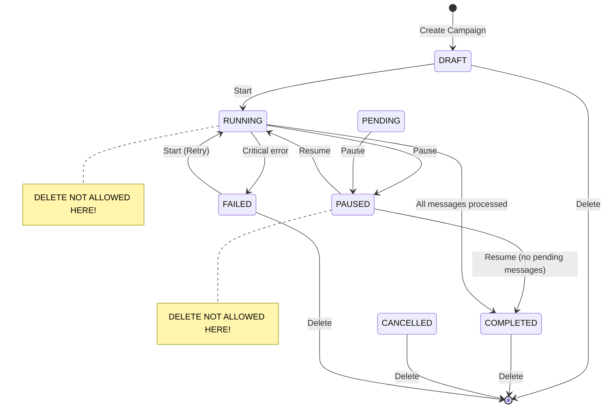
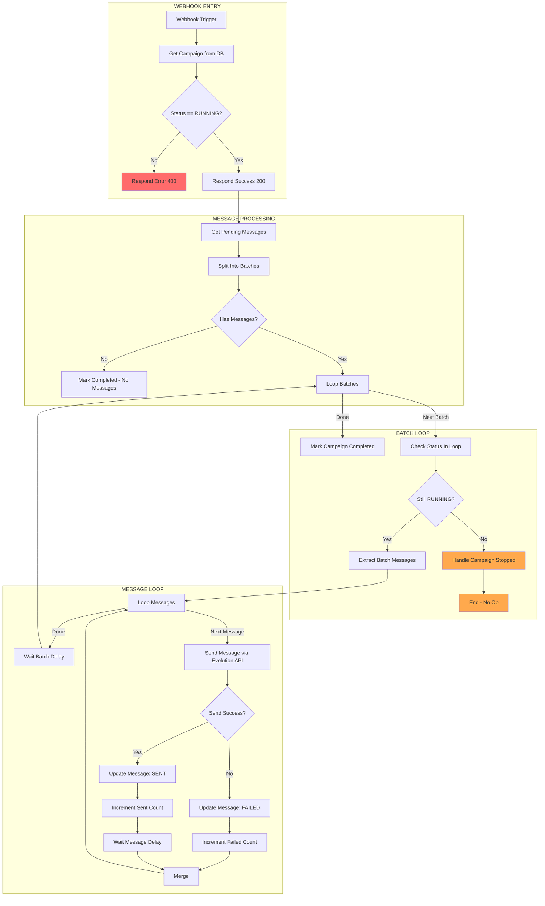
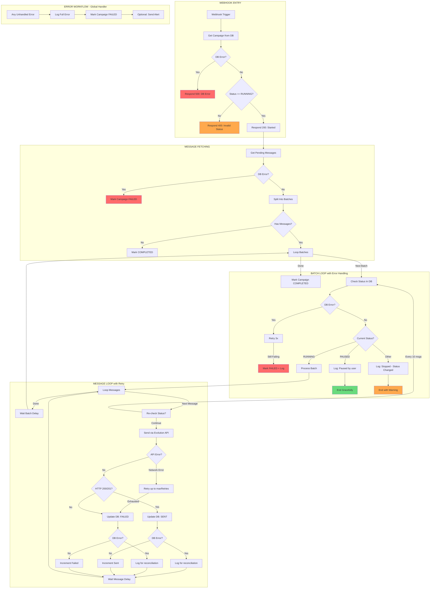
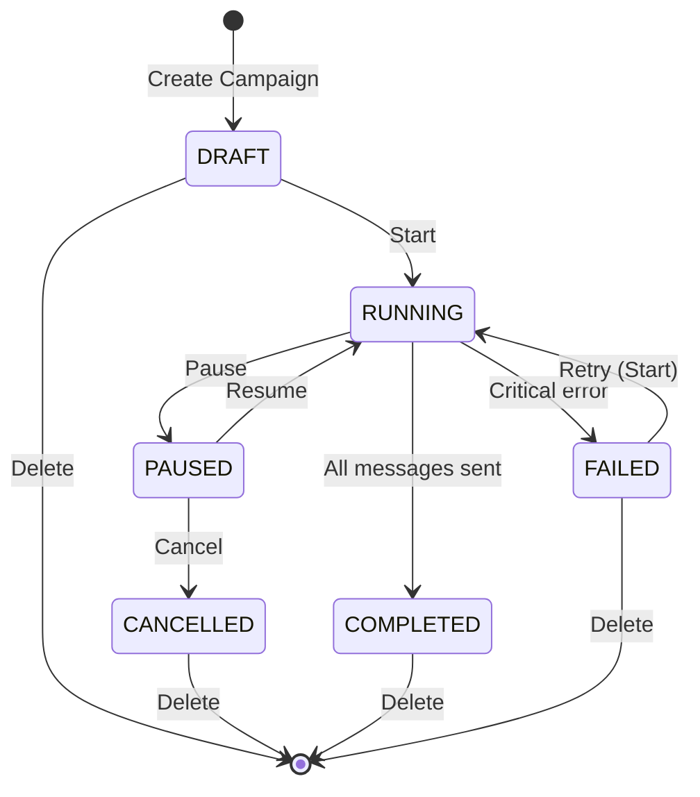

# Campaign Executor - Activity Diagram Analysis

## ✅ Fixed Issues

### Issue #1: Missing CANCEL Action (FIXED)

**Problem:** The UI instructed users to "Cancel the campaign before deleting" when attempting to delete a PAUSED campaign, but no cancel endpoint existed.

**Solution:**
- Created `/api/campaigns/[id]/cancel/route.ts` endpoint
- Only accepts PAUSED campaigns
- Updates status to CANCELLED
- Reverts QUEUED/PENDING messages to PENDING
- Updated `components/campaign-actions.tsx` to include Cancel action in UI
- Cancel button only enabled for PAUSED campaigns

**State Flow:**
```
PAUSED → CANCEL → CANCELLED → DELETE ✓
```

---

### Issue #2: No DB Error Handling in n8n (FIXED)

**Problem:** The workflow had no error handling for database operations. When a Postgres query failed, the workflow would crash silently, leaving campaigns in inconsistent states (e.g., RUNNING but not actually running).

**Solution:**
- Added `continueOnFail: true` to all PostgreSQL nodes
- Created error handler nodes for critical operations
- Implemented error-specific logic:
  - **Critical errors** (Get Campaign, Get Messages, Status Checks) → Mark campaign FAILED, stop execution
  - **Non-critical errors** (Message updates, counter increments) → Log for reconciliation, continue execution
- Added detailed logging with `[ERROR]` and `[RECONCILIATION]` tags

**Files:**
- New workflow: `workflows/n8n/campaign-executor-with-errors.json`
- Documentation: `docs/n8n-error-handling-implementation.md`
- Backup: `workflows/n8n/campaign-executor.backup.json`

**Error Flows:**
```
Get Campaign → [ERROR] → Respond 500 → END ✓
Get Messages → [ERROR] → Mark FAILED → END ✓
Status Check (loop) → [ERROR] → Mark FAILED → END ✓
Update Message → [ERROR] → Log for reconciliation → Continue ✓
Increment Counter → [ERROR] → Silent continue ✓
```

**Key Improvements:**
- No more silent workflow crashes
- Campaign state always persisted
- Reconciliation logs for message sync issues
- Graceful degradation for non-critical failures

---

### Issue #3: Race Condition in Resume (FIXED)

**Problem:** The Resume endpoint had a race condition where it triggered the n8n webhook BEFORE updating the database status to RUNNING. When n8n's "Check Campaign Status" node queried the database, it still showed PAUSED, causing the workflow to fail.

**Original Flow (BROKEN):**
```
/api/campaigns/[id]/resume:
  Line 102-127: Trigger n8n webhook
  Line 141-147: Update DB to RUNNING ❌ Too late!

n8n workflow:
  Get Campaign → Check Status → ❌ Still PAUSED → Fail
```

**Fixed Flow:**
```
/api/campaigns/[id]/resume:
  Line 97-102:  Update DB to RUNNING ✅ First!
  Line 105-113: Update messages to QUEUED
  Line 122-147: Trigger n8n webhook
  Line 151-167: If n8n fails, rollback to PAUSED

n8n workflow:
  Get Campaign → Check Status → ✅ RUNNING → Continue
```

**Changes Made:**
1. Moved DB update to happen BEFORE n8n webhook call
2. Added rollback logic if n8n call fails
3. Reverts campaign to PAUSED and messages to PENDING on failure
4. Updated documentation comments in code
5. Matches the pattern used in `/api/campaigns/[id]/start/route.ts` (which was correct)

**Files Changed:**
- `app/api/campaigns/[id]/resume/route.ts`

**Now Both Start and Resume Use Correct Pattern:**
```
✅ Update DB First → Then Trigger n8n → Rollback on Failure
```

---

### Issue #6: No Global Error Handler (FIXED)

**Problem:** When workflows crashed with unhandled errors, campaigns were left in inconsistent states (e.g., RUNNING but workflow terminated). No centralized error handling or logging existed.

**Solution:**
- Created `workflows/n8n/global-error-handler.json` - A separate workflow that catches all errors
- Automatically triggered when any workflow with `errorWorkflow` set encounters an unhandled error
- Extracts campaign ID from error context
- Marks campaigns as FAILED in database
- Logs comprehensive error information
- Optionally sends notifications (Slack, email, etc.)

**Files:**
- Workflow: `workflows/n8n/global-error-handler.json`
- Documentation: `docs/global-error-handler-guide.md`
- Setup: `workflows/n8n/SETUP-ERROR-HANDLER.md`

**Error Handler Flow:**
```
Campaign Executor → [UNHANDLED ERROR]
          ↓
Global Error Handler Activates
          ↓
1. Extract Error Info (workflow, node, message, campaign ID)
2. Has Campaign ID?
   ├─ Yes: Mark Campaign FAILED → Log Success
   └─ No:  Log Warning (non-campaign error)
3. Notifications Enabled?
   ├─ Yes: Prepare & Send Notification
   └─ No:  Skip
4. End Gracefully
```

**What It Catches:**
- Database connection failures
- Network timeouts
- Code execution errors
- API failures
- Any unhandled exception

**What It Does:**
```
✅ Marks campaign as FAILED
✅ Logs detailed error with stack trace
✅ Preserves execution context
✅ Sends notifications (optional)
✅ Never leaves campaigns in RUNNING state
```

**Error Log Example:**
```
========================================
GLOBAL ERROR HANDLER TRIGGERED
========================================
Workflow: Campaign Executor (workflow-id-123)
Execution ID: execution-id-456
Failed Node: Send Message
Error Message: ETIMEDOUT: connection timed out
Campaign ID: campaign-uuid-789
----------------------------------------
Stack Trace: Error: ETIMEDOUT...
========================================
```

**Setup Required:**
1. Import `global-error-handler.json` into n8n
2. Activate the error handler workflow
3. Update Campaign Executor settings:
   - Set `errorWorkflow` to Global Error Handler ID
4. Test with simulated error

**Key Improvements:**
- No more orphaned campaigns
- Centralized error logging
- Consistent state management
- Notification support
- Easy debugging with detailed logs

---

## Current State Machine

```
States: DRAFT, PENDING, RUNNING, PAUSED, COMPLETED, CANCELLED, FAILED
```

### Valid Transitions (from current code)



---

## ISSUE #1: Missing CANCEL Action

The UI says "Cancele a convocacao antes de excluir" (Cancel the campaign before deleting) when trying to delete a PAUSED campaign, but **there is NO cancel endpoint**!

```
Current: PAUSED --X--> DELETE (blocked, tells user to cancel first)
Missing: PAUSED --> CANCELLED --> DELETE
```

---

## Current n8n Workflow - Activity Diagram



---

## ISSUE #2: Missing Error Handling

The current workflow has **NO error handling** for:

### 2.1 Database Operation Failures
```
Current: If "Get Campaign" fails → Workflow crashes silently
Should:  If "Get Campaign" fails → Log error, respond 500, campaign stays in current state
```

### 2.2 Status Check Failure
```
Current: If "Check Status In Loop" DB query fails → Workflow crashes
Should:  If DB query fails → Retry or mark campaign FAILED
```

### 2.3 Message Update Failures
```
Current: If "Update Message Sent/Failed" fails → Message marked SENT in Evolution but not in DB
Should:  If DB update fails → Retry update, or flag for manual reconciliation
```

### 2.4 Counter Update Failures
```
Current: If increment count fails → Counts become inconsistent
Should:  Use DB transaction or accept eventual consistency
```

---

## ISSUE #3: Race Condition in Resume

**In `/api/campaigns/[id]/resume/route.ts`:**

```typescript
// Line 99-127: Triggers n8n webhook FIRST
const n8nResponse = await fetch(webhookUrl, { ... });

// Line 141-147: Updates DB status AFTER
await prisma.campaign.update({
  data: { status: CampaignStatus.RUNNING }
});
```

**Problem:** n8n workflow checks `status == RUNNING` but DB still shows `PAUSED`!

**In `/api/campaigns/[id]/start/route.ts`:**
```typescript
// Line 81-87: Updates DB FIRST (correct!)
await prisma.campaign.update({
  data: { status: CampaignStatus.RUNNING }
});

// Line 115-129: Triggers n8n AFTER
const n8nResponse = await fetch(webhookUrl, { ... });
```

---

## ISSUE #4: No Retry Mechanism

The workflow receives `maxRetries` config but **never uses it**:

```javascript
// In "Split Into Batches" node (line 111):
maxRetries: config.maxRetries || 3

// BUT: There's no retry logic anywhere in the workflow!
```

---

## ISSUE #5: Pause Detection Timing

When user pauses a campaign:
1. API sets `status = PAUSED` immediately
2. n8n only checks status at the START of each batch
3. Messages currently being sent continue until batch ends

**Gap:** A batch of 50 messages could all be sent after user clicked "Pause"

---

## PROPOSED: Complete Activity Diagram with Error Handling



---

## PROPOSED: Correct State Machine



### Required Actions:

| Current State | Allowed Actions |
|---------------|-----------------|
| DRAFT | Start, Delete |
| RUNNING | Pause |
| PAUSED | Resume, Cancel |
| COMPLETED | Delete |
| CANCELLED | Delete |
| FAILED | Start (retry), Delete |

---

## Summary of Issues Found

| # | Issue | Severity | Status | Fix Required |
|---|-------|----------|--------|--------------|
| 1 | Missing CANCEL action | HIGH | ✅ FIXED | ~~Add `/api/campaigns/[id]/cancel` endpoint~~ |
| 2 | No DB error handling in n8n | HIGH | ✅ FIXED | ~~Add error branches to all DB nodes~~ |
| 3 | Race condition in Resume | MEDIUM | ✅ FIXED | ~~Update DB to RUNNING *before* calling n8n~~ |
| 4 | No retry mechanism | MEDIUM | ⚠️ TODO | Implement retry loop for failed messages |
| 5 | Pause detection delay | LOW | ⚠️ TODO | Add periodic status checks within batches |
| 6 | No global error handler | HIGH | ✅ FIXED | ~~Set `errorWorkflow` in n8n settings~~ |
| 7 | Inconsistent counter updates | LOW | ⚠️ TODO | Consider using DB transactions |

---

## Next Steps

1. ~~**Add Cancel endpoint**~~ - ✅ DONE
2. ~~**Fix Resume race condition**~~ - ✅ DONE
3. ~~**Add error handling to n8n workflow**~~ - ✅ DONE
4. ~~**Configure error workflow**~~ - ✅ DONE
5. **Implement retry logic** - Use the `maxRetries` config that's already being passed
6. **Add periodic status checks** - Check status every N messages, not just per batch

## Deployment Checklist

Before deploying to production:

1. **Import workflows:**
   - [ ] Import `global-error-handler.json` and activate it
   - [ ] Import `campaign-executor-with-errors.json`
   - [ ] Link Campaign Executor to Error Handler (see `SETUP-ERROR-HANDLER.md`)

2. **Test error handling:**
   - [ ] Test Cancel flow: PAUSED → CANCELLED → DELETE
   - [ ] Test Resume flow: PAUSED → RUNNING (verify DB updated first)
   - [ ] Test Resume rollback: Stop n8n → Resume → Verify rollback
   - [ ] Test error handler: Simulate error → Verify campaign marked FAILED

3. **Configure notifications (optional):**
   - [ ] Set `ERROR_NOTIFICATIONS_ENABLED=true`
   - [ ] Replace "Send Notification (TODO)" node with Slack/Email node
   - [ ] Test notification delivery

4. **Monitor after deployment:**
   - [ ] Watch logs for `[ERROR]` and `[RECONCILIATION]` tags
   - [ ] Check campaign failure rate
   - [ ] Verify no campaigns stuck in RUNNING
   - [ ] Review error handler execution count
