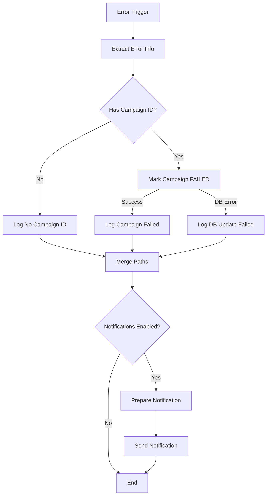

# Global Error Handler - Setup Guide

## Overview

The Global Error Handler is a separate n8n workflow that catches all unhandled errors from other workflows and takes corrective actions. This ensures that campaigns are never left in an inconsistent state when workflows crash.

**File:** `workflows/n8n/global-error-handler.json`

---

## What It Does

### When a Workflow Crashes

```
Campaign Executor → [UNHANDLED ERROR] → Workflow Crashes
                                          ↓
                            Global Error Handler Activates
                                          ↓
                              1. Extracts campaign ID
                              2. Marks campaign FAILED
                              3. Logs detailed error info
                              4. Sends notification (optional)
                                          ↓
                            Campaign state is consistent ✅
```

### Without Error Handler

```
Campaign Executor → [UNHANDLED ERROR] → ❌ Workflow crashes silently
                                        ❌ Campaign stuck in RUNNING
                                        ❌ No notification
                                        ❌ No logs
```

### With Error Handler

```
Campaign Executor → [UNHANDLED ERROR] → ✅ Error caught
                                        ✅ Campaign marked FAILED
                                        ✅ Detailed logs written
                                        ✅ Notification sent
```

---

## Installation

### Step 1: Import the Error Handler Workflow

1. Open n8n web interface
2. Go to **Workflows**
3. Click **Import from File**
4. Select `workflows/n8n/global-error-handler.json`
5. Click **Import**
6. The workflow will be created with the name "Global Error Handler"

### Step 2: Activate the Error Handler

1. Open the "Global Error Handler" workflow
2. Click **Activate** in the top right
3. Ensure it shows "Active" status

**IMPORTANT:** The error handler must be active to catch errors!

### Step 3: Configure Campaign Executor to Use Error Handler

You need to update the Campaign Executor workflow settings to reference the error handler.

#### Option A: Update Existing Workflow (Manual)

1. Open "Campaign Executor" (or "Campaign Executor with Error Handling")
2. Click **Workflow** → **Settings**
3. Find **Error Workflow** field
4. Select **Global Error Handler** from dropdown
5. Click **Save**

#### Option B: Update JSON File (Recommended)

Update the `settings` section in your campaign executor JSON:

**Before:**
```json
"settings": {
  "executionOrder": "v1",
  "saveManualExecutions": true,
  "callerPolicy": "workflowsFromSameOwner",
  "errorWorkflow": ""
}
```

**After:**
```json
"settings": {
  "executionOrder": "v1",
  "saveManualExecutions": true,
  "callerPolicy": "workflowsFromSameOwner",
  "errorWorkflow": "<WORKFLOW_ID>"
}
```

To get the workflow ID:
1. Open "Global Error Handler" in n8n
2. Copy the ID from the URL: `https://n8n.example.com/workflow/<ID>`
3. Paste it as the `errorWorkflow` value

---

## How It Works

### Flow Diagram



### Node Descriptions

#### 1. Error Trigger
- **Type:** Error Trigger
- **Purpose:** Catches errors from any workflow that references this error handler
- **Trigger:** Automatic when a workflow error occurs

#### 2. Extract Error Info
- **Type:** Code (JavaScript)
- **Purpose:** Extracts error details and campaign ID from error data
- **Outputs:**
  ```javascript
  {
    workflowId: string,
    workflowName: string,
    executionId: string,
    errorNode: string,
    errorMessage: string,
    errorStack: string,
    campaignId: string | null,
    timestamp: string,
    hasCampaignId: boolean
  }
  ```

#### 3. Has Campaign ID?
- **Type:** If Condition
- **Purpose:** Checks if campaign ID was found in error data
- **True:** Campaign-related error → mark as FAILED
- **False:** Non-campaign error → just log

#### 4. Mark Campaign FAILED
- **Type:** PostgreSQL
- **Query:** `UPDATE campaigns SET status = 'FAILED', completed_at = NOW() WHERE id = '<campaignId>'`
- **Purpose:** Updates database to mark campaign as failed
- **Error Handling:** `continueOnFail: true` - if this fails, logs for manual intervention

#### 5. Log Campaign Failed
- **Type:** Code (JavaScript)
- **Purpose:** Logs success message when campaign was marked as FAILED

#### 6. Log DB Update Failed
- **Type:** Code (JavaScript)
- **Purpose:** Logs critical error if DB update fails (requires manual intervention)

#### 7. Log No Campaign ID
- **Type:** Code (JavaScript)
- **Purpose:** Logs warning when error occurs in non-campaign workflow

#### 8. Notifications Enabled?
- **Type:** If Condition
- **Purpose:** Checks environment variable `ERROR_NOTIFICATIONS_ENABLED`
- **True:** Send notification
- **False:** Skip notification

#### 9. Prepare Notification
- **Type:** Code (JavaScript)
- **Purpose:** Formats error data for notification services
- **Outputs:** Formatted messages for Slack, email, etc.

#### 10. Send Notification (TODO)
- **Type:** Code (JavaScript) - Placeholder
- **Purpose:** Sends notification to external service
- **TODO:** Replace with actual notification node (Slack, Email, Discord, etc.)

---

## Configuration

### Environment Variables

Set these in n8n environment:

```bash
# Enable/disable error notifications
ERROR_NOTIFICATIONS_ENABLED=true
```

### Notification Setup (Optional)

The error handler includes a placeholder for notifications. To enable:

#### Option A: Slack Notifications

1. Replace the "Send Notification (TODO)" node with a **Slack** node
2. Configure Slack webhook URL
3. Use `{{ $json.slackText }}` as message

#### Option B: Email Notifications

1. Replace the "Send Notification (TODO)" node with an **Email** node
2. Configure SMTP settings
3. Use:
   - Subject: `{{ $json.emailSubject }}`
   - Body: `{{ $json.emailBody }}`

#### Option C: Custom Webhook

1. Replace the "Send Notification (TODO)" node with an **HTTP Request** node
2. Configure your webhook URL
3. Send the entire `$json` object

---

## Logs

### Log Format

The error handler writes structured logs:

```
========================================
GLOBAL ERROR HANDLER TRIGGERED
========================================
Workflow: Campaign Executor (workflow-id-123)
Execution ID: execution-id-456
Failed Node: Send Message
Error Message: ETIMEDOUT: connection timed out
Campaign ID: campaign-uuid-789
----------------------------------------
Stack Trace: Error: ETIMEDOUT...
========================================
```

### Log Levels

| Scenario | Level | Log Prefix |
|----------|-------|------------|
| Campaign marked FAILED | INFO | `[GLOBAL ERROR HANDLER]` |
| No campaign ID found | WARN | `[WARNING]` |
| DB update failed | ERROR | `[CRITICAL]` |

### Searching Logs

```bash
# Find all errors handled
grep "GLOBAL ERROR HANDLER TRIGGERED" n8n.log

# Find critical failures (manual intervention needed)
grep "\[CRITICAL\]" n8n.log

# Find specific campaign errors
grep "Campaign ID: campaign-uuid-123" n8n.log

# Find errors by workflow
grep "Workflow: Campaign Executor" n8n.log
```

---

## Testing

### Test 1: Simulate Campaign Error

1. Temporarily break the Campaign Executor workflow:
   - Edit "Send Message" node
   - Change URL to invalid endpoint
2. Start a campaign
3. Watch for error in logs
4. Verify:
   - ✅ Campaign status = FAILED in database
   - ✅ Error logged with details
   - ✅ Notification sent (if enabled)

### Test 2: DB Failure Handling

1. Temporarily stop PostgreSQL
2. Start a campaign
3. Let it error
4. Check logs for `[CRITICAL]` message
5. Verify manual intervention instructions logged

### Test 3: Non-Campaign Error

1. Create a test workflow without campaign ID
2. Add an error node that fails
3. Set error handler to Global Error Handler
4. Execute the workflow
5. Verify:
   - ✅ Warning logged
   - ✅ No DB update attempted
   - ✅ Workflow completes gracefully

---

## Troubleshooting

### Error Handler Not Triggering

**Symptom:** Workflow errors but error handler doesn't activate

**Fixes:**
1. Verify error handler is **Active** (not paused)
2. Check Campaign Executor has `errorWorkflow` set correctly
3. Ensure error handler workflow ID is correct
4. Check n8n logs for error handler execution

### Campaign ID Not Found

**Symptom:** Error handler logs "No campaign ID found"

**Cause:** Campaign ID not accessible in error data

**Fixes:**
1. Ensure webhook trigger includes `campaignId` in payload
2. Check that error occurred after webhook trigger
3. Verify campaign ID is passed through all nodes

### DB Update Fails

**Symptom:** `[CRITICAL]` logs about DB update failure

**Cause:** Database connection issue or campaign doesn't exist

**Actions:**
1. Check PostgreSQL is running
2. Verify database credentials in n8n
3. Manually update campaign:
   ```sql
   UPDATE campaigns SET status = 'FAILED', completed_at = NOW()
   WHERE id = '<campaign-id>';
   ```

### Notifications Not Sending

**Symptom:** Error handler works but no notifications

**Fixes:**
1. Check `ERROR_NOTIFICATIONS_ENABLED=true` is set
2. Verify notification node is configured correctly
3. Check notification service credentials
4. Test notification service independently

---

## Advanced Configuration

### Multiple Error Handlers

You can create specialized error handlers for different workflows:

1. **Critical Errors** - Immediate alerts
2. **Warning Errors** - Daily digest
3. **Campaign Errors** - This handler
4. **Integration Errors** - Different handler

### Custom Error Logic

Modify "Extract Error Info" node to add custom logic:

```javascript
// Example: Only handle specific error types
if (errorMessage.includes('ETIMEDOUT')) {
  // Network timeout - mark as FAILED
  return [{ json: { ...data, shouldFail: true } }];
} else if (errorMessage.includes('Database error')) {
  // DB error - retry later
  return [{ json: { ...data, shouldRetry: true } }];
}
```

### Error Metrics

Add a node to track error metrics:

```javascript
// Send to analytics service
await fetch('https://analytics.example.com/metrics', {
  method: 'POST',
  body: JSON.stringify({
    metric: 'campaign_error',
    campaignId: campaignId,
    errorType: errorNode,
    timestamp: new Date().toISOString()
  })
});
```

---

## Security Considerations

### Sensitive Data

The error handler logs may contain sensitive information:

- Campaign IDs
- Error messages with data
- Stack traces with code paths

**Recommendations:**
1. Restrict access to n8n logs
2. Sanitize error messages before logging
3. Don't include PII in error data
4. Rotate logs regularly

### Database Access

The error handler needs PostgreSQL access:

- Uses same credentials as Campaign Executor
- Only performs UPDATE on campaigns table
- `continueOnFail: true` prevents cascading failures

---

## Maintenance

### Regular Tasks

| Task | Frequency | Purpose |
|------|-----------|---------|
| Review error logs | Daily | Identify recurring issues |
| Check critical errors | Immediate | Manual intervention needed |
| Test error handler | Weekly | Ensure it's working |
| Update notification config | As needed | Keep contacts current |

### Monitoring

Set up monitoring for:

- Error handler execution count (should be low)
- Critical error count (should be zero)
- Campaign failure rate
- DB update failures

---

## Migration from Old Setup

If you were using the original Campaign Executor without error handling:

1. Import Global Error Handler workflow
2. Activate it
3. Update Campaign Executor settings:
   - Add `errorWorkflow` reference
4. Test with a small campaign
5. Monitor for 24 hours
6. Deploy to production

---

## Comparison

### Before Global Error Handler

```
Workflow Error → ❌ Silent crash
              → ❌ Campaign stuck in RUNNING
              → ❌ No notification
              → ❌ No recovery
```

### After Global Error Handler

```
Workflow Error → ✅ Caught by error handler
              → ✅ Campaign marked FAILED
              → ✅ Team notified
              → ✅ Detailed logs
              → ✅ Ready for manual recovery
```

---

## References

- n8n Error Trigger Documentation: https://docs.n8n.io/integrations/builtin/core-nodes/n8n-nodes-base.errortrigger/
- Error Workflow Setup: https://docs.n8n.io/workflows/error-handling/
- Related: `docs/n8n-error-handling-implementation.md`
- Related: `docs/campaign-activity-diagram.md`

---

## Conclusion

The Global Error Handler ensures that:

✅ No campaign is ever stuck in RUNNING state
✅ All errors are logged with context
✅ Teams are notified of critical issues
✅ Manual recovery is straightforward
✅ Error metrics are trackable

This completes Issue #6 from the activity diagram analysis.
